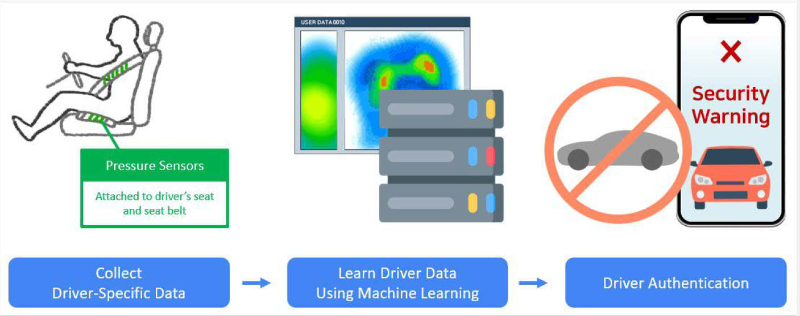
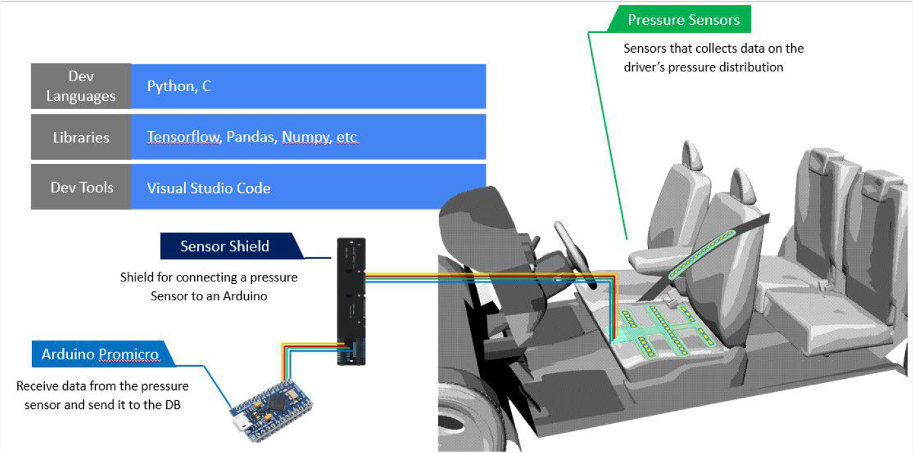
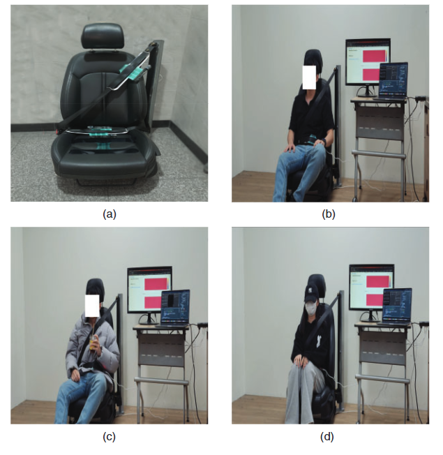
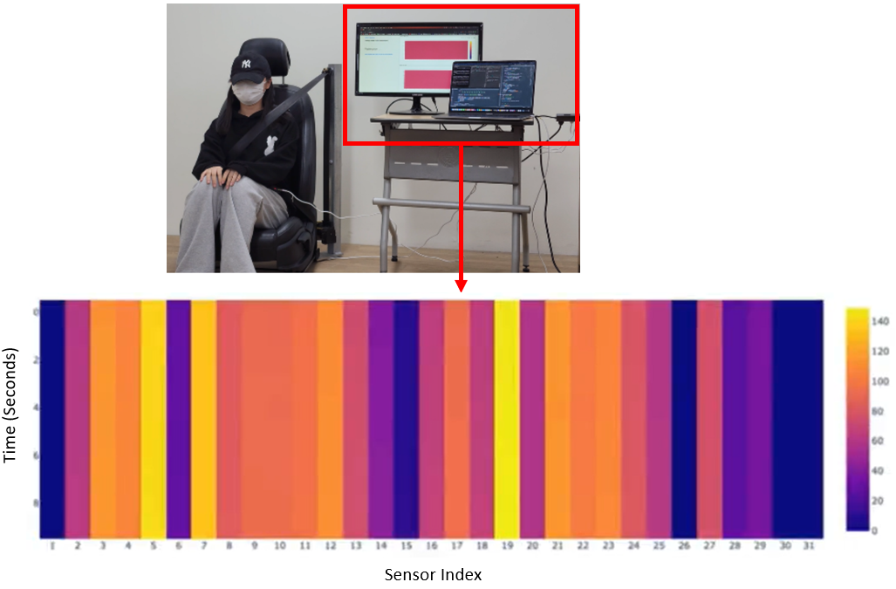
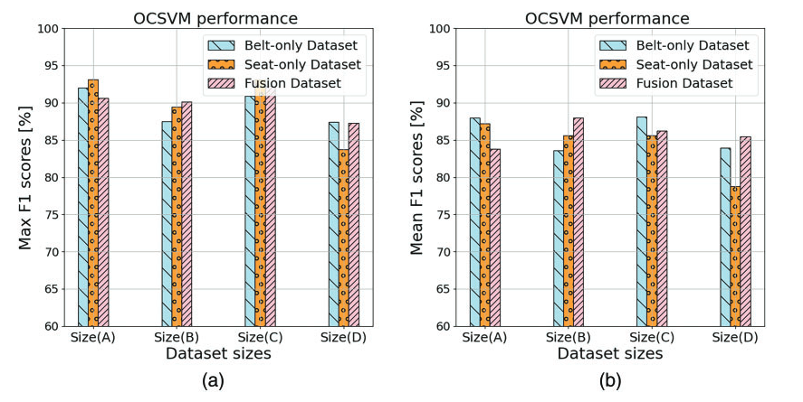
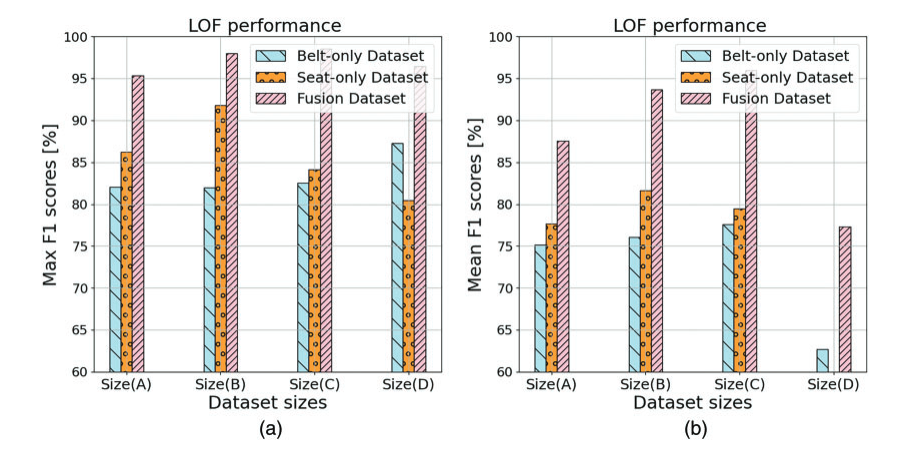
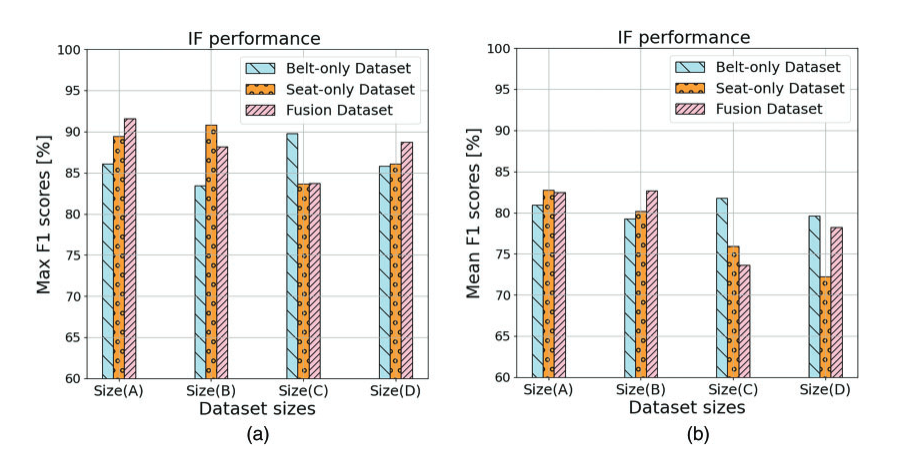
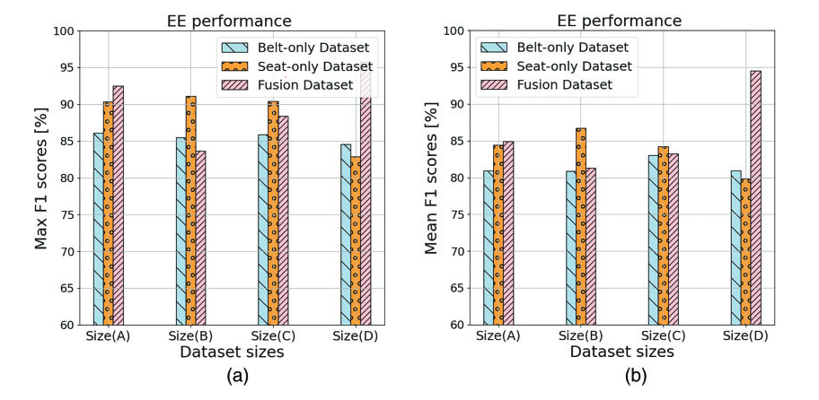

# DriveMe: Towards Lightweight and Practical Driver Authentication System Using Single-Sensor Pressure Data

<p align="center">

Official implementation of the CMES 2025 paper.

</p>

---

## 📄 Paper

**DriveMe: Towards Lightweight and Practical Driver Authentication System Using Single-Sensor Pressure Data**

**Journal**

Computer Modeling in Engineering & Sciences (CMES)

2025

DOI:
https://doi.org/10.32604/cmes.2025.063819

---

## Abstract

Driver authentication has become an essential component of intelligent transportation systems for preventing vehicle theft and unauthorized access. Existing approaches often rely on multiple in-vehicle sensors, CAN bus data, cameras, smartphones, or GPS information, making them expensive, slow, and difficult to deploy in real-world environments.

DriveMe proposes a lightweight and practical driver authentication framework that relies only on pressure measurements collected from a single pressure sensor installed on the driver's seat or seat belt. The system performs one-class learning, allowing each vehicle owner to build an individual authentication model while treating all other drivers as attackers.

Extensive real-world experiments involving 12 participants demonstrate that DriveMe achieves high authentication accuracy within only a few seconds while preserving users' privacy and requiring minimal hardware.

---

# ⭐ Main Contributions

- Lightweight driver authentication using only pressure sensor data.
- Practical one-class learning that requires only legitimate driver's data for training.
- Fast authentication using only 1–10 seconds of pressure measurements.
- Real-world dataset collected from 12 participants under different seating conditions.
- Comprehensive evaluation using four one-class machine learning algorithms.
- Open-source implementation and dataset for reproducible research.

---

# 🏗 System Architecture

<p align="center">

</p>

The DriveMe pipeline consists of four major stages:

1. Pressure data collection
2. Data preprocessing
3. One-class driver model learning
4. Driver authentication

# The steps show how the development environment of our system was built.

<p align="center">

</p>


---

# 📂 Repository Structure

```
Driver-Authentication-DriveMe/
│
├── Code/
│     main.py
│     helper.py
│     drift_code.py
│     plot_driver.py
│
├── Dataset/
│     Belt/
│     Seat/
│     README.md
│
├── Figures/
│
├── Results/
│
├── LICENSE
├── README.md
└── CITATION.bib
```

---

# 📊 Dataset

The dataset was collected from **12 drivers** using **30 pressure sensors** attached to either the driver's seat or seat belt.

## Dataset Statistics

| Dataset | Recording Time | Samples/Experiment | Total Samples |
|-----------|---------------|-------------------:|--------------:|
| Belt Size A | 5 s | 50 | 6,000 |
| Belt Size B | 3 s | 30 | 3,600 |
| Belt Size C | 2 s | 20 | 2,400 |
| Belt Size D | 1 s | 10 | 1,200 |
| Seat Size A | 10 s | 100 | 12,000 |
| Seat Size B | 5 s | 50 | 6,000 |
| Seat Size C | 3 s | 30 | 3,600 |
| Seat Size D | 1 s | 10 | 1,200 |

Total:

- 12 users
- 960 CSV files
- 36,000 pressure samples
- 30 pressure sensors

---
# 📷 Example Dataset Collection and Pressure Visualization

<p align="center">

</p>


<p align="center">

</p>

---


# ⚙️ Experimental Settings

Machine learning models

- One-Class SVM
- Local Outlier Factor (LOF)
- Isolation Forest
- Elliptic Envelope

Evaluation

- Belt dataset
- Seat dataset
- Fusion dataset

Training ratios

- 50/50
- 60/40
- 70/30
- 80/20
- 90/10

---

# 📈 Experimental Results

## Overall Authentication Performance

<p align="center">

</p>

<p align="center">

</p>

<p align="center">

</p>

<p align="center">

</p>


DriveMe achieved

| Model | Best F1 Score |
|--------|--------------:|
| OCSVM | 93.10% |
| LOF | 98.53% |
| Isolation Forest | 91.65% |
| Elliptic Envelope | 95.79% |

---


# 🚀 Getting Started

Clone repository

```bash
git clone https://github.com/Mohsen-Ali-Alawami/Driver-Authentication-DriveMe-.git
```

Install

```bash
pip install -r requirements.txt
```

Run

```bash
python main.py
```

---

# 👨‍💻 Contributors

- Mohsen Ali Alawami
- Dahyun Jung
- Yewon Park
- Yoonseo Ku
- Gyeonghwan Choi
- Ki-Woong Park

---

# 📚 Citation

```bibtex
@article{ALAWAMI20252361,
title = {DriveMe: Towards Lightweight and Practical Driver Authentication System Using Single-Sensor Pressure Data},
journal = {CMES - Computer Modeling in Engineering and Sciences},
volume = {143},
number = {2},
pages = {2361-2389},
year = {2025},
issn = {1526-1492},
doi = {https://doi.org/10.32604/cmes.2025.063819},
url = {https://www.sciencedirect.com/science/article/pii/S1526149225001213},
author = {Mohsen Ali Alawami and Dahyun Jung and Yewon Park and Yoonseo Ku and Gyeonghwan Choi and Ki-Woong Park}
}
```

---

# 📧 Contact

**Prof. Mohsen Ali Alawami**

Assistant Professor

Division of Computer Engineering

Hankuk University of Foreign Studies

Republic of Korea

Email:
mohsencomm@hufs.ac.kr

GitHub:
https://github.com/Mohsen-Ali-Alawami

---

# License

MIT License

For academic and research purposes.
